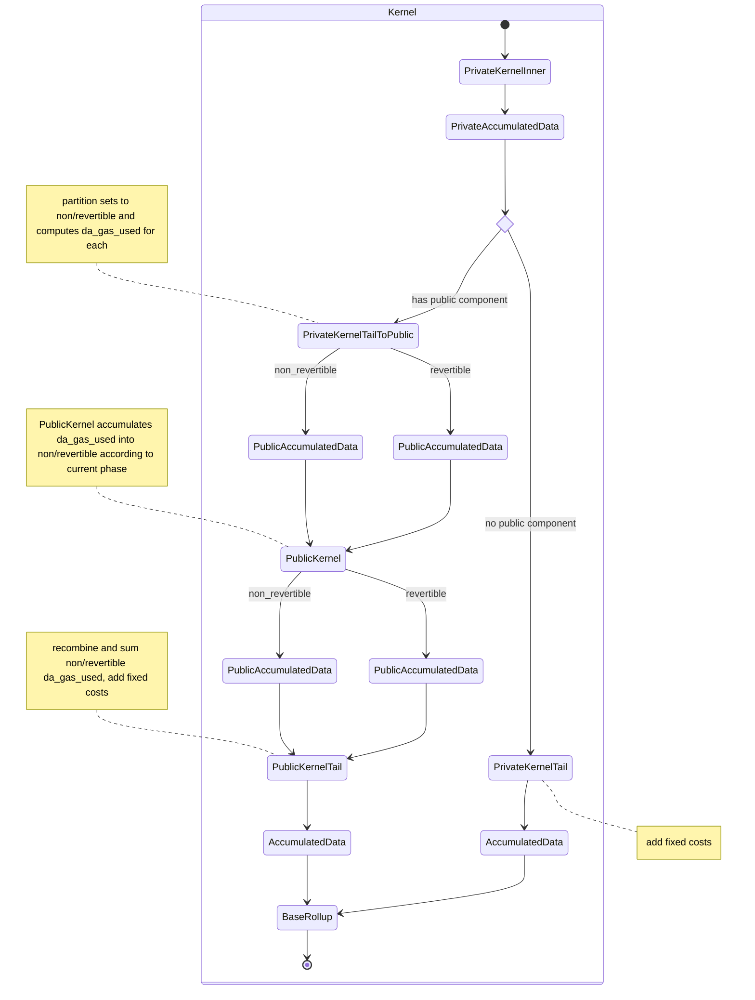

Every transaction [publishes data](../data-publication-and-availability/published-data.md) to a data availability solution. We must therefore keep track of the amount of data that would be published by each transaction, and allow the user to configure the fee they are willing to pay for this data.

# User Transaction Variables

The user must be able to specify:

- `da_gas_limit`: the maximum amount of DA gas they are willing to pay for
- `da_gas_price`: the price they are willing to pay per unit of DA gas

# DA Layer

The DA solution in use is ethereum call data.

# DA Costs per Transaction

A transaction consumes a variable amount of DA gas, calculated as:

```
da_gas_used = FIXED_DA_GAS +
                note_hash_gas +
                nullifier_gas +
                l2_to_l1_message_gas +
                public_data_writes_gas +
                log_gas
```

where

```
DA_GAS_PER_BYTE = 16
// 17 * 16; 8 for da_gas_used, 8 for compute_gas_used, 1 for revert_code, times DA_GAS_PER_BYTE
FIXED_DA_GAS = 272
DA_BYTES_PER_FIELD = 32
```

and

```
note_hash_gas = da_gas_per_field * (number of notes)
nullifier_gas = da_gas_per_field * (number of nullifiers)
l2_to_l1_message_gas = da_gas_per_field * (number of l2_to_l1_messages)
public_data_writes_gas = 2 * da_gas_per_field * (number of public_data_writes)
DA_BYTES_PER_FIELD = 32
da_gas_per_field = DA_BYTES_PER_FIELD * DA_GAS_PER_BYTE
```

finally

```
log_gas = DA_GAS_PER_BYTE * (unencrypted_log_preimages_length + encrypted_log_preimages_length)
```

## Deviation from ethereum calldata pricing

Our `da_gas_used` will be correlated with the actual ethereum gas consumed by the published call, but not equal.

This is because calculating the exact cost requires us to know how many non-zero bytes are in the calldata, which includes the `da_gas_used` itself. Since the `da_gas_used` must be produced in our kernel circuits, such a recursive calculation would unnecessarily complicate the circuit design.

Instead, using a fixed cost plus scaling on actual resources consumed dramatically simplifies calculations, is a reasonable approximation, and affords abstraction if/when we transition to a different DA solution.

## Inclusion in published transactions

The `da_gas_used` values are included in the [published transaction data](../data-publication-and-availability/published-data.md).

# Tracking `da_gas_used` in kernels

There are 3 different structures that accumulate data in the kernel:

- `PrivateAccumulatedData`
- `PublicAccumulatedData`
- `AccumulatedData`

The `AccumulatedData` struct is the final structure that is passed to the base rollup.

The `PrivateAccumulatedData` and `PublicAccumulatedData` structs are used to accumulate data in the private and public kernels, respectively.

All of these structs contain a `da_gas_used` field.

# Tracking `da_gas_limit` in kernels

The user must specify a `da_gas_limit` for each transaction. This value is set in the private transaction, set in `PrivateKernelPublicInputs` (similar to `min_revertible_side_effect_counter`), passed to the `PublicKernelPublicInputs` as necessary, and through to the `KernelCircuitPublicInputs`.


# Kernel state diagram

The current state diagram is as follows:



# Pure private transactions

If a transaction has no public component, the `da_gas_used` is computed in the private kernel tail based on the formula above.

The private kernel tail will add the fixed costs to the `da_gas_used` value, and assert that the total `da_gas_used` is less than or equal to the `da_gas_limit` in the `PrivateKernelPublicInputs`.

# Interaction with the public VM

The public VM retains the current amount of `daGasLeft` in its [MachineState](../public-vm/state.md#machine-state).

This amount must be initialized for each public kernel iteration as:

```
daGasLeft := public_kernel_public_inputs.da_gas_limit 
             - public_kernel_public_inputs.end_non_revertible.da_gas_used
             - public_kernel_public_inputs.end.da_gas_used
```

At the end of execution, the public VM will have an updated `daGasLeft` value.

This value will be used by the public kernel to update the `da_gas_used` in the `PublicAccumulatedData` struct corresponding to the current phase:

```
# if in setup or teardown (non-revertible) phase (and no revert)
public_kernel_public_inputs.end_non_revertible.da_gas_used := 
        public_kernel_public_inputs.da_gas_limit
          - daGasLeft
          - public_kernel_public_inputs.end.da_gas_used

# if in app logic (revertible) phase (and no revert)
public_kernel_public_inputs.end.da_gas_used := 
        public_kernel_public_inputs.da_gas_limit
          - daGasLeft
          - public_kernel_public_inputs.end_non_revertible.da_gas_used
```

# Out of gas

Public execution must stop as soon as possible once `daGasLeft` is exhausted.

The public VM will revert if an exception is thrown, including an out of gas exception.
When this occurs, the public VM will return a revert code.

If this occurs in a non-revertible phase, the transaction is invalid and cannot be included in the block.

If this occurs in a revertible phase, the value of  `public_kernel_public_inputs.end.da_gas_used` will be set to 0; this affords the teardown phase the opportunity to consume DA gas.


# Public transactions

If a transaction has a public component, the `da_gas_used` is computed in the `PrivateKernelTailToPublic` circuit for both the `revertible` and `non-revertible` sets.


# Recombining for base rollup

```
kernel_public_inputs.da_gas_used =
    FIXED_DA_GAS +
    public_kernel_public_inputs.end_non_revertible.da_gas_used +
    public_kernel_public_inputs.revert_code == 0 ? 
      public_kernel_public_inputs.revertible.da_gas_used : 0
```

## Content commitment

The `da_gas_used` and `da_gas_limit` values are included in the content commitment for the base rollup.

The values are up-casted from `u64` to `Field` for the content commitment.

This is matched when computing the content commitment in the L1 transaction decoder.

